# numpy-diffusion (under development)

## What it is?
This is a numpy implementation of the Denoising Diffusion Probabilistic Model (DDPM), that runs at CPU with numpy or GPU with cupy (but it's better to train it on a GPU if you don't want to wait indefinitely)

Some methods were borrowed from my [numpy-nn-model](https://github.com/AkiRusProd/numpy-nn-model) repository.

## Datasets
#### As examples on which the model can be trained, the following datasets are selected:
- [MNIST](https://pjreddie.com/projects/mnist-in-csv/) - consists of 70,000 single channel images of digits
- [CIFAR-10](https://www.cs.toronto.edu/~kriz/cifar.html) - consists of 60,000 different colour images in 10 classes
- [UTKFace](https://susanqq.github.io/UTKFace/) - consists of 20,000 colour images of faces

## Project Structure
#### Diffusion model trainer:
- [diffusion.py](diffusion/diffusion.py) - initializes and trains the model

#### Model training on the datasets:
- [train_mnist.py](diffusion/train_mnist.py)
- [train_cifar_10.py](diffusion/train_cifar_10.py)
- [train_utkface.py](diffusion/train_utkface.py)

#### Architectures:
- [simple_convnet.py](diffusion/architectures/simple_convnet.py) - just simple convolutional model architecture
- [unet.py](diffusion/architectures/unet.py) - unet like model architecture

#### Functional components:
- [activations.py](diffusion/activations.py) - list of activation functions for the model
- [losses.py](diffusion/losses.py) -  list of loss functions for the model. But used only MSE Loss
- [optimizers.py](diffusion/optimizers.py) - list of gradient optimizers for the model
- [schedules.py](diffusion/schedules.py) - beta schedules for the DDPM
- [layers](diffusion/layers) - neural network layers like Dense, Conv2D, etc

#### Special utils:
- [import_mnist_data.py](import_mnist_data.py)
- [import_cifar_10_data.py](import_cifar_10_data.py)
- [import_utkface_data.py](import_utkface_data.py)

## Samples
#### Samples of a model trained on 1-3 epochs on the MNIST dataset:

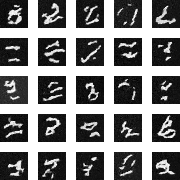
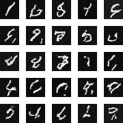
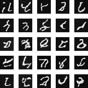

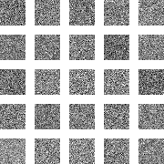
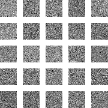
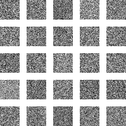

#### Samples of a model trained on 1-3 epochs on the CIFAR-10 dataset:

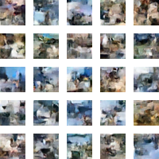
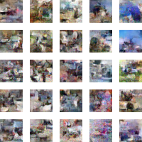
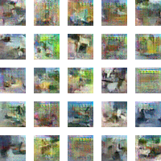

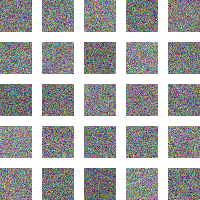
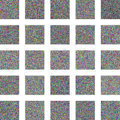
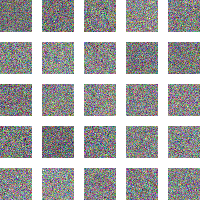

#### Samples of a model trained on 18-20 epochs on the UTKFace dataset:

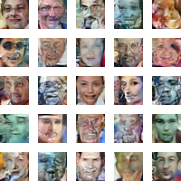
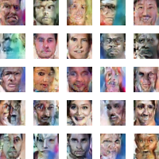

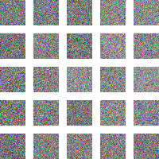
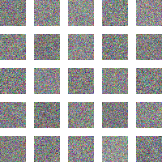
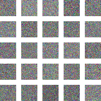

### References:
- [Denoising Diffusion Probabilistic Models](https://arxiv.org/abs/2006.11239)
- [Improved Denoising Diffusion Probabilistic Models](https://arxiv.org/abs/2102.09672)
### Additional literature:
- [The Annotated Diffusion Model](https://huggingface.co/blog/annotated-diffusion)
- [What are diffusion models?](https://lilianweng.github.io/posts/2021-07-11-diffusion-models)
- [Denoising Diffusion Probabilistic Models (DDPM)](https://nn.labml.ai/diffusion/ddpm/index.html)

